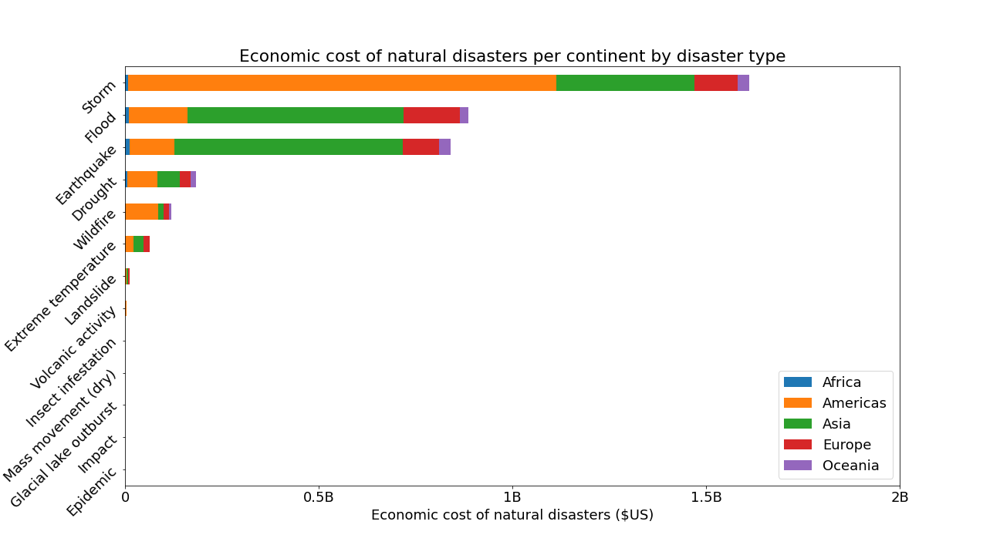
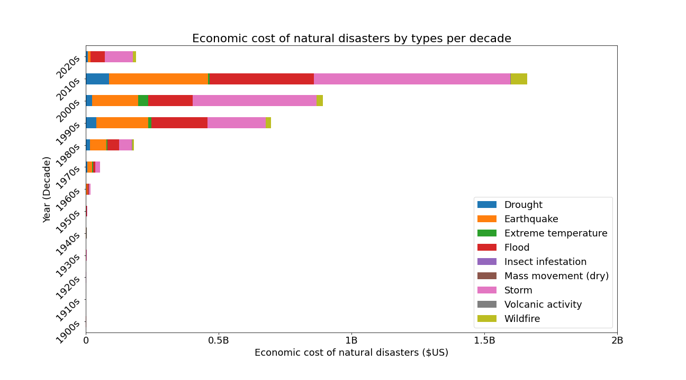

# EMDAT - The Emergency Events Database

EMDAT contains essential core data on the occurrence and effects of over 22,000 mass disasters in the world from 1900 to 2021. The database is compiled from various sources, including UN agencies, non-governmental organisations, insurance companies, research institutes and press agencies.

## Data Set Information: [emdat.be](https://www.emdat.be)

## Trend of Natural Disaster by Continent, Country, & Types

- The predominant causes of natural disasters are flood and storm - they occur mostly in Asia and Americas, particularly in the united states and China.

- Storm produced the most economic cost over the years.

## Number of Occurrences of  Nautral Disaster

- The occurrence of natural disasters was very minimal between the decades 1900s & 1910s,  probably due to lack of data. However, as the years went by the occurrence of natural disasters increases exponentially especially between 1990 & 2004. Then, it seems to be decreasing afterwards.

- The occurrence rate of earthquakes is decreasing, whereas the occurrence rate floods and storms is increasing

## Number of Deaths from  Natural Disaster

- The total number of death fluctuates as the years went by. The peak near the decade 1920s signifies the maximum recorded number of death from natural disasters. From 2000s upwards, the recorded number of death from natural disasters is very small. This can be as a result of technological advances.

## Number of Homeless & Affected by  Natural Disaster

- The homelessness due to natural disasters reached a maximum peak between decades 1990s & 2000s. This is consistent with the increase in the occurrence of natural disasters within these years.

- The total number of people affected by natural disasters reached a maximum peak between the years 2000 & 2003. This is consistent with the increase in the occurrence of natural disasters within these years

## Economic Cost of Natural Disaster

As we can see, the economic cost of natural disaster seems to be exponentially increasing every decade and reached a maximum peak at 2010s, which is mainly caused by storm and flood in the United States of America.

## Trends of Natural Disaster by Hour

## Trends of Natural Disaster by Start Month

